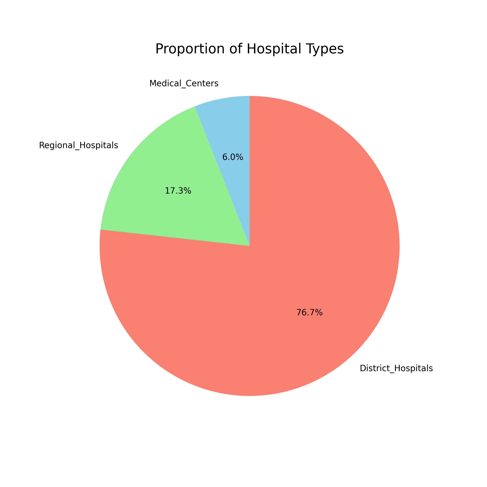
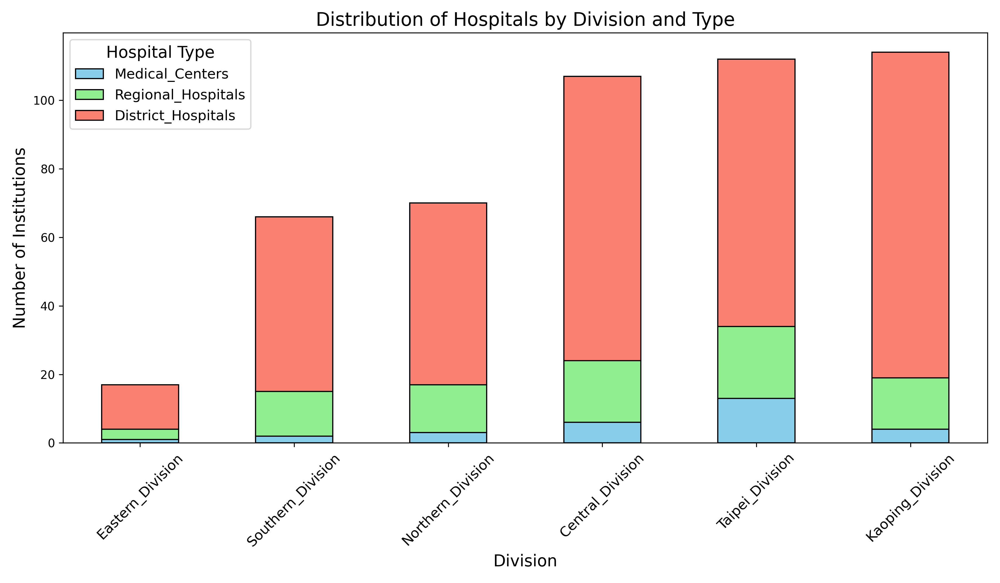
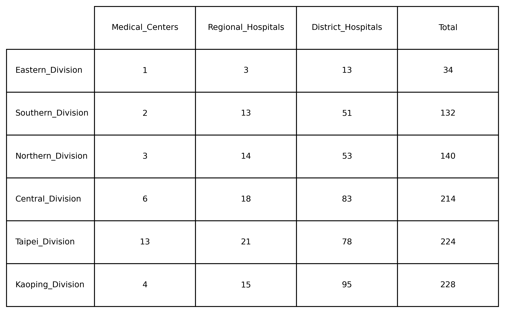

# python-hospital-data-visualization

This project automates the download and visualization of hospital institution data from the Taiwan National Health Insurance (NHI) website.

Using Python and Selenium, it simulates browser interaction to download hospital datasets in CSV format. The script converts these datasets into Excel files, enriches the data with translated labels, and generates three types of visualizations:
- 📊 Stacked bar chart
- 📋 Summary table
- 🥧 Pie chart

All output files are timestamped and stored in structured folders. Logs are recorded throughout the process for traceability and debugging purposes.

---

## 🧰 Features

- Fully automated Selenium-based data download  
- Converts downloaded CSV files to Excel format  
- Appends translated English labels for division and hospital type  
- Generates publication-ready visualizations with Matplotlib  
- Structured folder management and logging system  

---

## 📁 Repository Structure

```
/src/           ← Python automation and visualization script  
/images/        ← Output charts and tables (optional)  
/example/       ← Sample input CSVs or logs (optional)
```

---

## ⚙️ Requirements

This project requires the following packages:

```bash
pip install pandas matplotlib selenium openpyxl
```

You will also need:

- Chrome browser  
- [ChromeDriver](https://sites.google.com/chromium.org/driver/) (must match your Chrome version and be added to PATH)

---

## ▶️ How to Use

1. Clone the repository and navigate to the `/src/` folder.  
2. Edit `main.py` if needed (e.g., modify target URLs or folder paths).  
3. Run the script:

    ```bash
    python main.py
    ```

4. The script will:
    - Create folders on your Desktop (`Health_Care_Institutions/csv`, `excel`, `visualizations`, `log`)
    - Download and rename CSV files
    - Generate Excel files
    - Produce stacked bar chart, pie chart, and table image
    - Save all outputs with timestamps

---

## 🖼 Output Samples

All charts will be saved in the `/visualizations/` folder, e.g.:
Here are examples generated by the script:

### 🥧 Pie Chart


### 📊 Stacked Bar Chart


### 📋 Summary Table



---

## 🗂 Data Source

All hospital datasets are retrieved from Taiwan’s NHI open data platform:  
https://info.nhi.gov.tw/IODE0000/IODE0000S09

This repository is for educational and demonstration purposes only.

---

## 🧩 License

This project is licensed under the MIT License.  
Feel free to reuse or modify the code with proper attribution.
```

---
